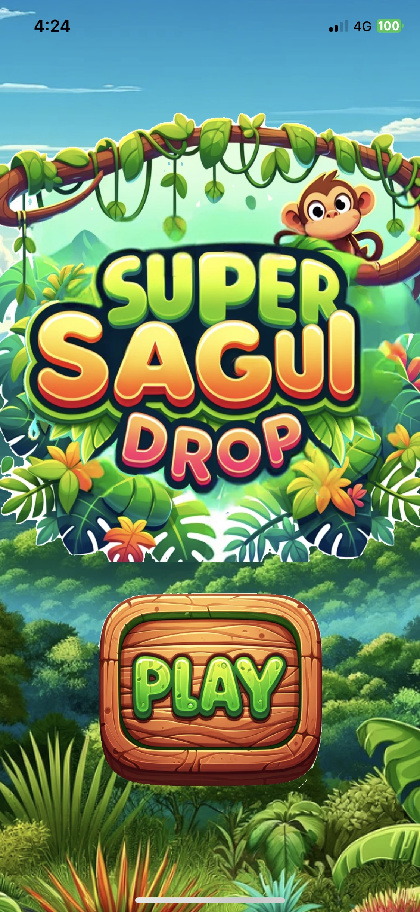
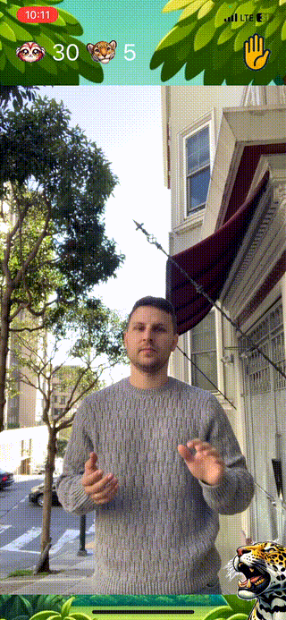
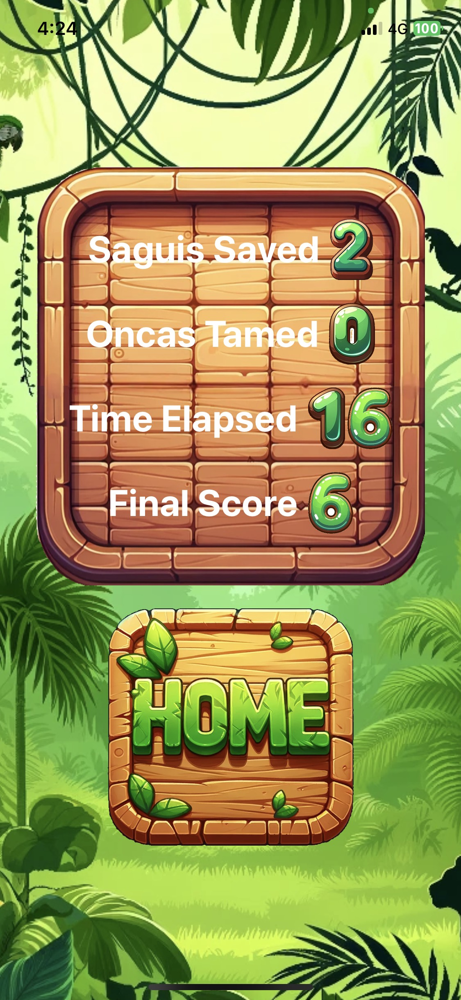

# Super Sagui Drop

## Game Overview

Super Sagui Drop is an iOS game that uses Apple's Vision Framework for hand-tracking. Players interact with falling marmosets, known locally as "saguis", and attacking jaguars, or "onças".

### How to Play

### Hand Tracking
An icon will appear at the top right of the screen that indicates whether any hands are detected (the game can detect up to 2 hands at once.) It will show a dotted outline of a hand when no hands are seen.

#### Intercepting Saguis
- The saguis will fall from trees
- Use your hands, tracked in real-time, to catch them.
- Successfully catching a sagui awards points.

#### Petting Oncas
- Onças will appear randomly
- Use your hands to pet them.
- Successfully taming an onça awards extra points.

### Scoring
- Points are awarded for: total saguis caught, onças tamed, and the total time elapsed during the game.
- The game ends when the player fails to catch 3 falling saguis.

#### Save Score
- Players can save their scores to a server by pressing the "Save Score" button.
- Scores from the past week can be seen by pressing the "Scoreboard" button on the title screen.

### Images

#### Home Screen

#### Game Screen

#### Score Screen

