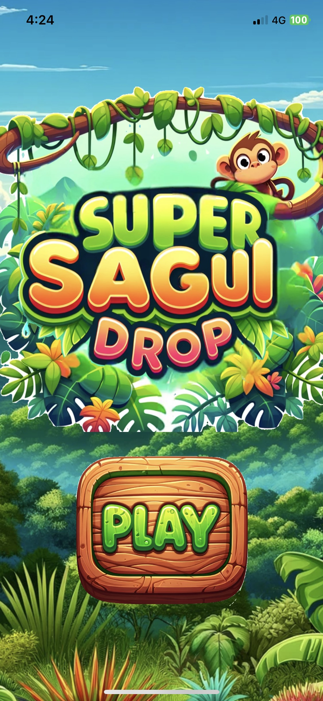
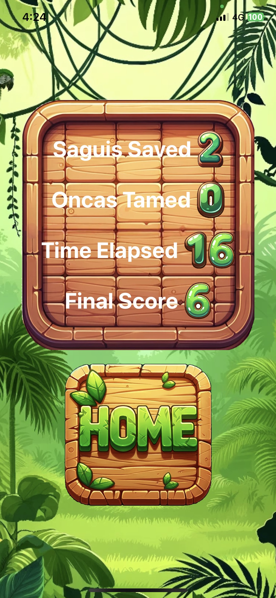

# Super Sagui Drop

## Game Overview

Super Sagui Drop is an iOS game that uses Apple's Vision Framework for hand-tracking. Players interact with falling marmosets, known locally as "saguis", and attacking jaguars, or "oncas".

### How to Play

#### Intercepting Saguis
- The saguis will fall from trees (to-do: at various speeds and angles)
- Use your hands, tracked in real-time, to catch them.
- Successfully catching a sagui awards points.

#### Petting Oncas
- Oncas will appear randomly (to-do: and move towards you.)
- Use your hands to pet them.
- Successfully taming an onca awards extra points.

### Scoring
- Points are awarded for: total saguis caught, oncas tamed, and the total time elapsed during the game.
- The game ends when the player fails to catch 3 falling saguis. (to-do: or when health points lost due to onca attack.)

### Images

#### Home Screen

#### Game Screen

#### Score Screen

